# Testing

> [!NOTE]  
> Return back to the [README.md](README.md) file.

## Code Validation

### HTML

I have used the recommended [HTML W3C Validator](https://validator.w3.org) to validate all of my HTML files.

| Directory | File            | Screenshot                                                        | Notes     |
| --------- | --------------- | ----------------------------------------------------------------- | --------- |
|           | end.html        |         | No errors |
|           | game.html       |        | No errors |
|           | highscores.html |  | No errors |
|           | index.html      |       | No errors |

### CSS

I have used the recommended [CSS Jigsaw Validator](https://jigsaw.w3.org/css-validator) to validate all of my CSS files.

| Directory | File      | Screenshot                                                 | Notes     |
| --------- | --------- | ---------------------------------------------------------- | --------- |
| assets    | style.css |  | No errors |

### JavaScript

I have used the recommended [JShint Validator](https://jshint.com) to validate all of my JS files.

| Directory | File          | Screenshot                                                          | Notes     |
| --------- | ------------- | ------------------------------------------------------------------- | --------- |
| assets    | category.js   | 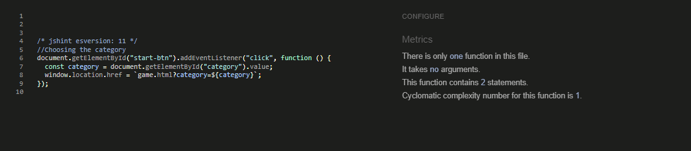  | No errors |
| assets    | end.js        | 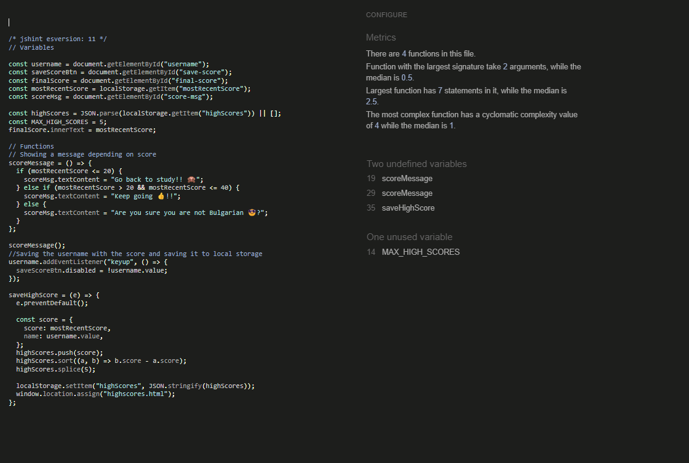        | No errors |
| assets    | highscores.js | 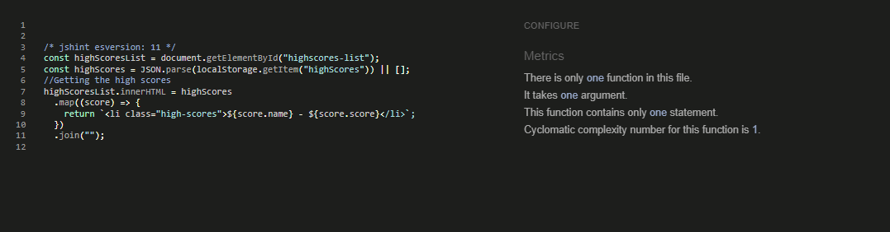 | No errors |
| assets    | questions.js  | 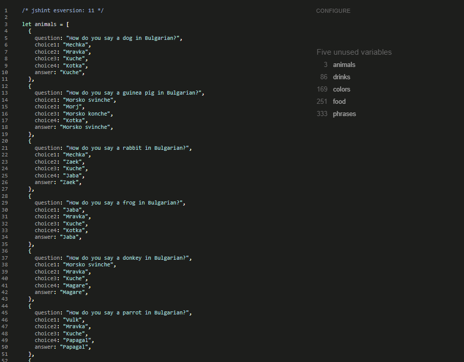  | No errors |
| assets    | script.js     | 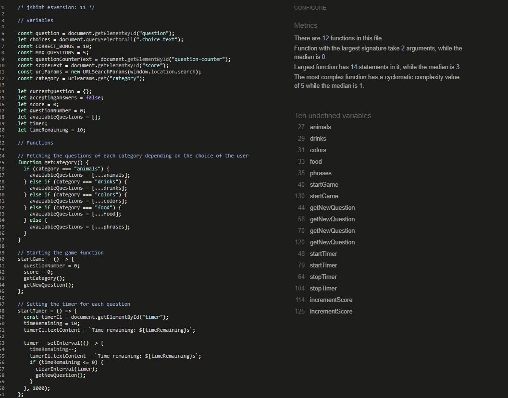     | No errors |

## Browser Compatibility

I've tested my deployed project on multiple browsers to check for compatibility issues.

| Browser | Home                                                   | Game                                                   | End                                                   | High scores                                                  | Notes             |
| ------- | ------------------------------------------------------ | ------------------------------------------------------ | ----------------------------------------------------- | ------------------------------------------------------------ | ----------------- |
| Chrome  |   |   |   |   | Works as expected |
| Firefox |  |  |  |  | Works as expected |
| Edge    |     |     |     |     | Works as expected |
| Opera   |    |    | 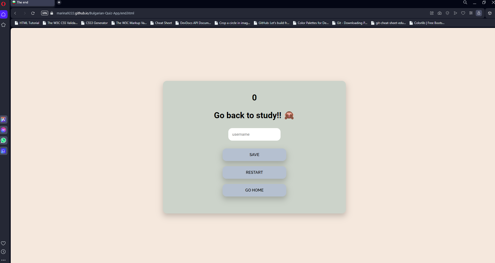   |    | Works as expected |

## Responsiveness

I've tested my deployed project on multiple devices to check for responsiveness issues.

| Device            | Home                                                          | Game                                                          | End                                                          | High scores                                                        | Notes             |
| ----------------- | ------------------------------------------------------------- | ------------------------------------------------------------- | ------------------------------------------------------------ | ------------------------------------------------------------------ | ----------------- |
| Mobile (DevTools) |    |    |    |    | Works as expected |
| Tablet (DevTools) |    |    |    |    | Works as expected |
| Desktop           |   |   |   |   | Works as expected |
| iPhone 13         |  |  |  |  | Minor issue       |

## Lighthouse Audit

I've tested my deployed project using the Lighthouse Audit tool to check for any major issues.

| Page            | Mobile                                                        | Desktop                                                        | Notes               |
| --------------- | ------------------------------------------------------------- | -------------------------------------------------------------- | ------------------- |
| Home page       |        |        | Some minor warnings |
| Game page       |        |        | Works good          |
| End page        |         |         | Works good          |
| Highscores page |  |  | Works good          |

## Defensive Programming

Defensive programming was manually tested with the below user acceptance testing:

| Page        | Expectation                                                                                | Test                                                                                                                 | Result                                                                                                     | Fix                       | Screenshot                                                  |
| ----------- | ------------------------------------------------------------------------------------------ | -------------------------------------------------------------------------------------------------------------------- | ---------------------------------------------------------------------------------------------------------- | ------------------------- | ----------------------------------------------------------- |
| Home        |                                                                                            |                                                                                                                      |                                                                                                            |                           |                                                             |
|             | Start game button is expected to start the game when the user click on it                  | Tested the feature by clicking the button.                                                                           | The feature behaved as expected, and it did start the game                                                 | Test concluded and passed |   |
|             | Select category is expected to allow the user to select category when the user click on it | Tested the feature by clicking on it.                                                                                | The feature behaved as expected, and it did change category.                                               | Test concluded and passed |   |
|             | High scores button is expected to redirect the user to the high scores page.               | Tested the feature by doing clicking on it.                                                                          | The feature behaved as expected, and it did redirect me to the high scores page.                           | Test concluded and passed |  |
| Game        |                                                                                            |                                                                                                                      |                                                                                                            |                           |                                                             |
|             | Clicking on the right answer is expected to change the color to green when clicked         | Tested the feature by choosing the right answer                                                                      | The feature behaved as expected, and it did turn green                                                     | Test concluded and passed |   |
|             | Clicking on the wrong answer is expected to change the color to red when clicked           | Tested the feature by choosing the wrong answer                                                                      | The feature behaved as expected, and it did turn red                                                       | Test concluded and passed |   |
|             | Clicking on the restart button is expected to restart the game when clicked                | Tested the feature by clicking on it                                                                                 | The feature behaved as expected, and it did restart the game                                               | Test concluded and passed |   |
|             | Clicking on the home button is expected to redirect the user to the home page              | Tested the feature by choosing clicking on it                                                                        | The feature behaved as expected, and it redirected me to the home page                                     | Test concluded and passed |   |
|             | Score should increment by 10 on every guessed question                                     | Tested the feature by choosing the right answer on every question                                                    | The feature behaved as expected, and it did increment my score by 10 for each question that I have guessed | Test concluded and passed |   |
|             | 10 second Timer                                                                            | Tested the feature by waiting for the whole 10 seconds to pass to check if it would redirect me to the next question | The feature behaved as expected, and it did redirect me                                                    | Test concluded and passed |   |
| End         |                                                                                            |                                                                                                                      |                                                                                                            |                           |                                                             |
|             | Showing the right end score                                                                | Tested the feature by playing the game                                                                               | The feature behaved as expected, and it show my accurate score                                             | Test concluded and passed |   |
|             | Message depending on the end score                                                         | Tested the feature by getting different score                                                                        | The feature behaved as expected, and it change the message depending on score                              | Test concluded and passed |  |
|             | Enter username to save your score                                                          | Tested the feature by entering my name                                                                               | The feature behaved as expected, and it save my score                                                      | Test concluded and passed |  |
|             | Not letting the user to click on the save button if there is no name entered               | Tested the feature by leaving the username empty                                                                     | The feature behaved as expected, and it didnt let me to click save                                         | Test concluded and passed |  |
|             | Restart button is expected to restart the game when clicked                                | Tested the feature by clicking on it                                                                                 | The feature behaved as expected, and it did reset the game                                                 | Test concluded and passed |  |
|             | Go home button is expected to redirect the user to the home page                           | Tested the feature by licking on it                                                                                  | The feature behaved as expected, and it did redirect me to the home page                                   | Test concluded and passed |  |
| High scores |                                                                                            |                                                                                                                      |                                                                                                            |                           |                                                             |
|             | High score chart showing top 5 high scores                                                 | Tested the feature by playing the game and getting different scores and saving them                                  | The feature behaved as expected, and it show my accurate score and position on the chart                   | Test concluded and passed | 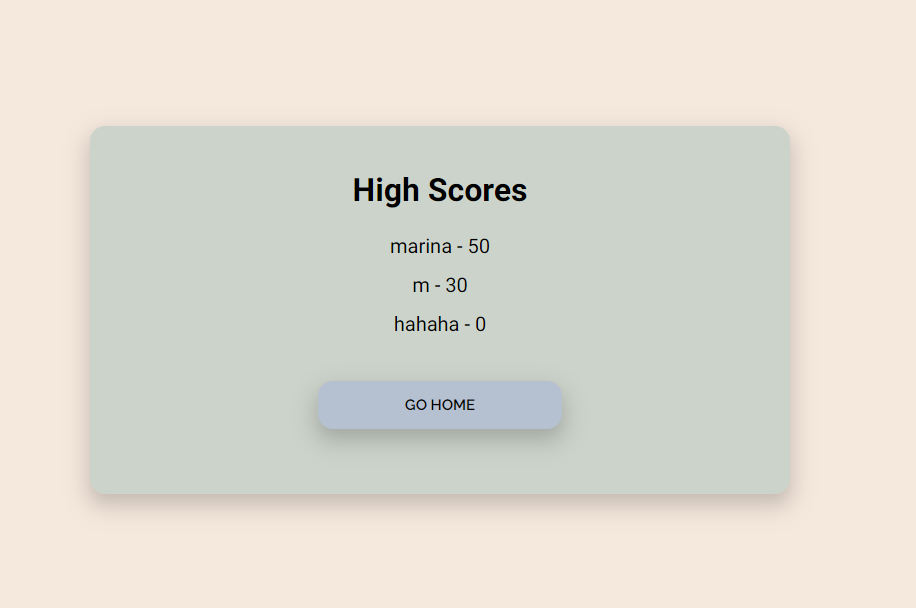 |
|             | Go home button redirecting to the home page                                                | Tested the feature by clicking on it                                                                                 | The feature behaved as expected, and it did redirect me to the home page.                                  | Test concluded and passed | 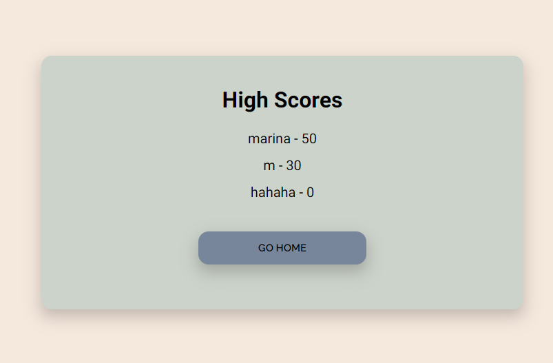 |

## User Story Testing

| User Story                                                                                                                 | Screenshot                                          |
| -------------------------------------------------------------------------------------------------------------------------- | --------------------------------------------------- |
| As a new site user, I would like to have a simple menu, so that I can navigate easily through the app..                    | 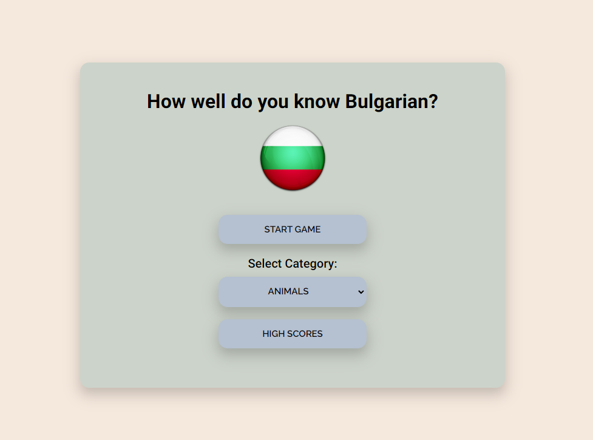 |
| As a new site user, I would like to have category selection, so that I can practice my knowledge on different areas.       | 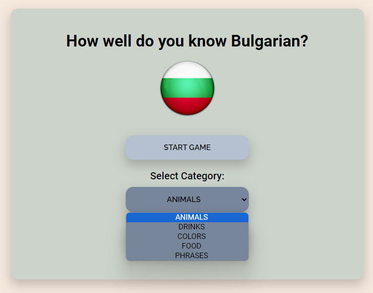 |
| As a new site user, I would like to see a high score chart after the game , so that I can try and improve my score.        | 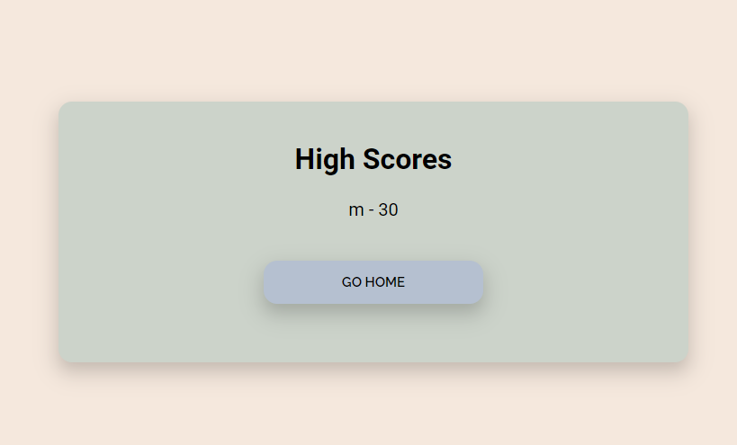 |
| As a new site user, I would like to have a variety of questions, so that I can learn and practice more.                    |  |
| As a returning site user, I would like to have more categories, so that I can practices on different areas.                |  |
| As a returning site user, I would like to have a difficulty selections, so that I can test my level of bulgarian language. |  |
| As a returning site user, I would like to choose my time per questions , so that I can have more or less time to answer.   |  |

## Bugs

- JS Uncaught ReferenceError: `question` is undefined/not defined at startGame function

  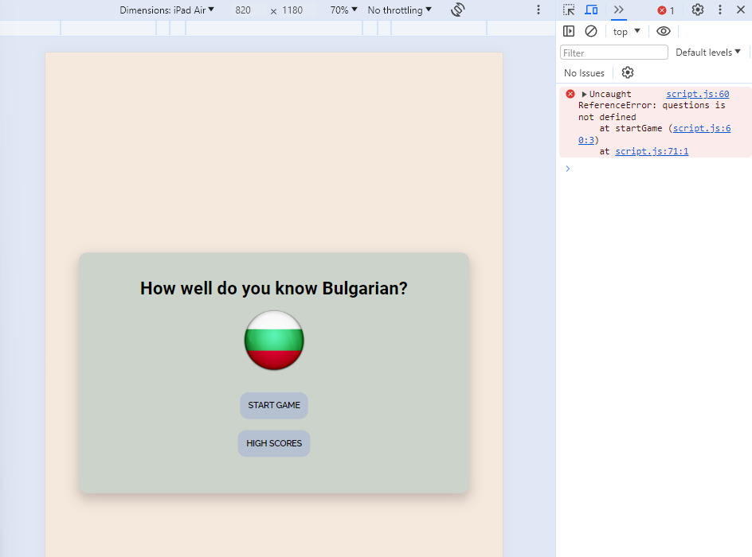

  - To fix this, I created a new variable called questions instead of putting them in the available questions array.

- JS TypeError: Assignment to constant variable at HTMLParagraphElement (showing that the right answer on the question is wrong).

  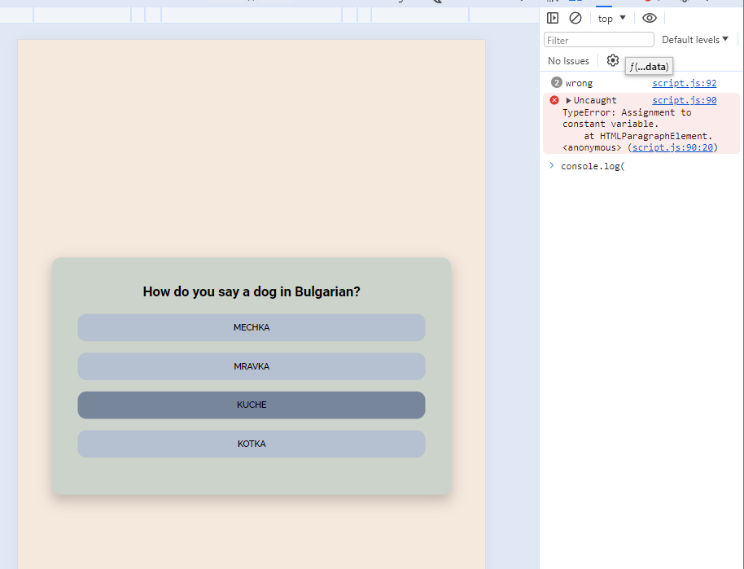

  - To fix this, I removed the parentElement on addClass.

- CSS When answer has been clicked and cursor stays on the answer doesnt change color to incorrect or correct.

  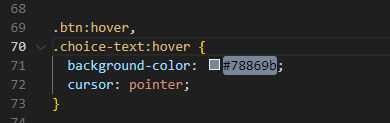

  - To fix this, I changed the .choice-text:hover to .choice-text:not (.incorrect and correct):hover.

  - JS Timer was skipping numbers or going quicker that it should on next question.

  

  - To fix this, I moved the stopTimer function from outside in the end to the beginning of the addEventListener function.

## Unfixed Bugs

- CSS On mobile device after selecting an answer doesnt matter if its correct or incorrect the next questions shows dark grey background of the previous chosen answer from previous question.

  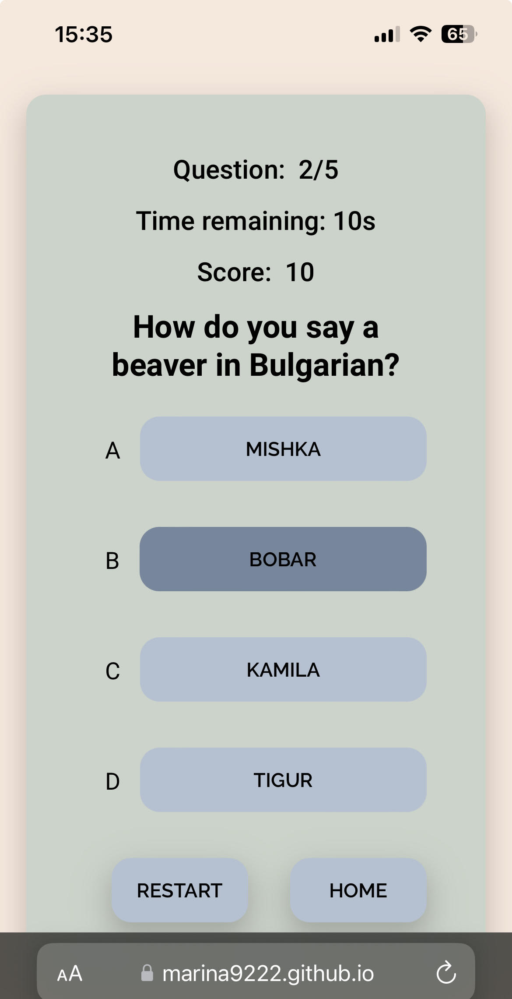

- Attempted fix: I tried everything , used chatgpt as well but with no luck.

> [!NOTE]  
> There are no remaining bugs that I am aware of.
